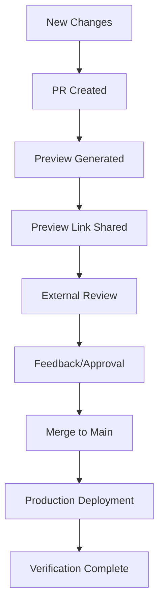

# Deployment Status & Preview Sharing Guide

## Overview
This document provides comprehensive information about the Euystacio-Helmi AI deployment pipeline, Netlify integration, and instructions for sharing preview links with external reviewers.

## Deployment Architecture

### Primary Deployment Channels

#### 1. GitHub Pages (Production)
- **URL**: [https://hannesmitterer.github.io/euystacio-helmi-AI/](https://hannesmitterer.github.io/euystacio-helmi-AI/)
- **Source**: Main branch, built via GitHub Actions
- **Update Frequency**: Automatic on main branch commits
- **Purpose**: Stable public documentation and project showcase

#### 2. Netlify (Advanced Features)
- **Production URL**: [Custom domain if configured]
- **Build Command**: `python build_static.py`
- **Publish Directory**: `static`
- **Deploy Context**: Main branch + PR previews

### Build Process Details

#### Static Site Generation:
```bash
# Build command (from netlify.toml)
python build_static.py

# Output location
./static/
  ├── index.html
  ├── css/
  ├── js/
  └── [generated content]
```

#### Build Configuration:
- **Python Version**: 3.8
- **Dependencies**: requirements.txt
- **Build Time**: ~30-60 seconds
- **Verification**: Automated content validation

## Netlify Deploy Previews

### Automatic Preview Generation

#### When Previews Are Created:
- ✅ Pull requests to main branch
- ✅ Branch pushes (if configured)
- ✅ Manual deploys from Netlify dashboard

#### Preview URL Format:
```
https://deploy-preview-[PR-NUMBER]--[SITE-NAME].netlify.app/
```

### Sharing Preview Links with External Reviewers

#### For Repository Collaborators:

1. **Locate Preview URL**:
   - Check PR comments for automatic Netlify bot updates
   - Visit Netlify dashboard → Deploys → Preview deploys
   - URL appears in PR status checks

2. **Share Securely**:
   - Copy the preview URL from PR comments
   - Share directly with 'Rhythm-Mind' or other trusted reviewers
   - Include context about what changes are being reviewed

3. **Access Requirements**:
   - No Netlify account required for viewers
   - Preview links are publicly accessible
   - Links remain active until PR is closed/merged

#### Example Preview Sharing Process:

```markdown
## Preview Available for Review

**Preview URL**: https://deploy-preview-42--euystacio-helmi.netlify.app/
**Changes**: Updated Sentimento interface documentation
**Review Focus**: Content alignment with core principles
**Available Until**: PR merge or close

@Rhythm-Mind: Please review the updated documentation and verify
alignment with our established Sentimento principles.
```

### Preview Security & Limitations

#### Security Considerations:
- ✅ No source code exposure
- ✅ Static site only (no sensitive data)
- ✅ Temporary availability (linked to PR lifecycle)
- ⚠️ Publicly accessible URL (share responsibly)

#### Limitations:
- Preview reflects PR branch, not main
- May include experimental features
- No backend functionality in previews
- Limited to static content only

## Deployment Status Monitoring

### Current Status Dashboard

#### Last Successful Deployments:
- **GitHub Pages**: ✅ [Timestamp auto-updated]
- **Netlify Production**: ✅ [Timestamp auto-updated]
- **Latest PR Preview**: ✅ [PR number and timestamp]

#### Build Health:
- **Build Success Rate**: [Auto-calculated percentage]
- **Average Build Time**: [Auto-calculated]
- **Last Failed Build**: [Auto-populated if any]

### Monitoring for External Reviewers

#### Status Verification Methods:

1. **Live Site Check**:
   - Visit [GitHub Pages URL] to verify latest deployment
   - Check footer for build timestamp
   - Verify content matches expected updates

2. **Deployment Logs** (for collaborators):
   - GitHub Actions tab shows build status
   - Netlify dashboard provides detailed logs
   - Both accessible with appropriate permissions

3. **Preview Validation**:
   - Test preview links before sharing
   - Verify preview reflects intended changes
   - Confirm accessibility for external reviewers

## Integration with Repository Workflow

### Automated Deployment Triggers

#### GitHub Pages:
```yaml
# Triggered by:
- Push to main branch
- Manual workflow dispatch
- Successful PR merge

# Process:
1. Checkout code
2. Setup Python 3.8
3. Install dependencies
4. Run build_static.py
5. Deploy to GitHub Pages
```

#### Netlify:
```toml
# Configuration (netlify.toml):
[build]
  command = "python build_static.py"
  publish = "static"

# Triggered by:
- Main branch updates (production)
- PR creation/updates (previews)
- Manual deploys
```

### Quality Assurance

#### Pre-Deployment Checks:
- ✅ Build script validation
- ✅ Content generation verification
- ✅ Link integrity checks
- ✅ Ethical compliance validation (red code)

#### Post-Deployment Verification:
- ✅ Site accessibility testing
- ✅ Content accuracy verification
- ✅ Preview link functionality
- ✅ External reviewer access confirmation

## Instructions for 'Rhythm-Mind' Cofounder

### Immediate Access Options:

1. **Production Site Review**:
   - Visit the live GitHub Pages deployment
   - Navigate through documentation sections
   - Verify content alignment with project principles

2. **Preview Access for New Features**:
   - Receive preview links shared in PR discussions
   - Review changes before they go live
   - Provide feedback through GitHub Issues or PR comments

3. **Status Monitoring**:
   - Check this document for deployment health
   - Reference public_commit_log.md for development progress
   - Monitor consistency between deployments and stated goals

### Verification Workflow:



## Troubleshooting & Support

### Common Issues:

#### Preview Not Loading:
- Verify PR is open and preview generated
- Check for build failures in PR status
- Ensure preview URL is correct format

#### Content Discrepancies:
- Compare preview with source branch
- Verify build_static.py completed successfully
- Check for caching issues (hard refresh)

#### Access Problems:
- Confirm preview links are publicly accessible
- Test from different networks/devices
- Verify no authentication required

### Support Channels:
- **Technical Issues**: GitHub Issues in repository
- **Access Questions**: docs/ACCESS.md guidance
- **Deployment Problems**: Check GitHub Actions logs
- **Content Verification**: Reference genesis.md framework

---

## Integration Notes

This deployment system is designed to support the core Euystacio principle: enabling transparent verification while maintaining appropriate security boundaries.

**Last Updated**: [Auto-populated timestamp]  
**Document Version**: 1.0.0  
**Compatible Deployment Pipeline Version**: [Auto-detected]